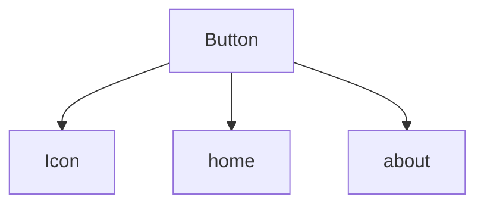
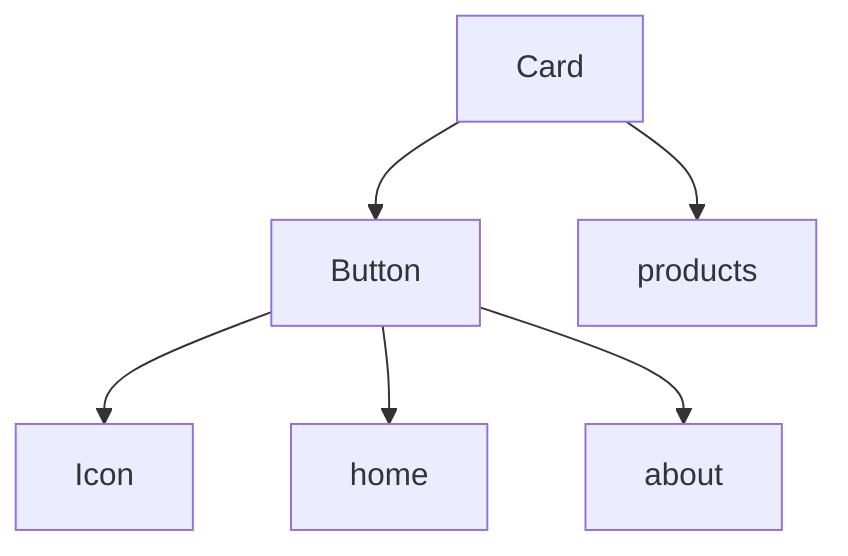

# React Dependency Analyzer

[](https://badge.fury.io/js/react-dep-analyzer)
[](https://github.com/LiTaiChung/react-dep-analyzer/blob/main/LICENSE)

## 安裝

使用 npm：
```bash
npm install react-dep-analyzer
```

使用 yarn：
```bash
yarn add react-dep-analyzer
```

## 使用方式

### 1. 新增腳本指令

在你的 `package.json` 中加入以下腳本：

```json
{
  "scripts": {
    "analyze": "node scripts/analyze.mjs"
  }
}
```

### 2. 建立分析腳本

建立檔案 `scripts/analyze.mjs`：

```javascript
import { createAnalyzer } from 'react-dep-analyzer';

// 建立分析器實例
const analyzer = createAnalyzer({
  // 自定義配置（可選）
  name: 'Component',
  targetPath: 'src/components',
  pagesPath: 'src/pages',
});

// 執行分析
analyzer.run();

// 生成所有格式的報告
analyzer.generateMarkDown();
analyzer.generateDependencyTree();
analyzer.generateJson();
```

### 3. 執行分析

使用 npm：
```bash
npm run analyze
```

使用 yarn：
```bash
yarn analyze
```

### 4. 配置 package.json

如果你的專案使用了 `"type": "module"`，可以直接執行上述指令。如果沒有，需要在 `package.json` 中加入：

```json
{
  "type": "module"
}
```

或者在執行指令時加入 `--experimental-modules` 標記：

```json
{
  "scripts": {
    "analyze": "node --experimental-modules scripts/analyze.mjs"
  }
}
```

## 基本使用

```typescript
import { createAnalyzer } from 'react-dep-analyzer';

// 使用預設配置建立分析器
const analyzer = createAnalyzer();

// 執行分析
analyzer.run();

// 生成 Markdown 文檔（包含索引和個別元件文檔）
analyzer.generateMarkDown();

// 生成完整依賴樹圖
analyzer.generateDependencyTree();

// 生成 JSON 格式報告
analyzer.generateJson();
```

## 配置選項

你可以透過傳入配置物件來自定義分析器的行為：

```typescript
interface ComponentPathConfig {
  path: string;          // 元件目錄路徑
  importPrefix: string;  // import 語句的前綴
}

const analyzer = createAnalyzer({
  name: 'Component',              // 分析報告的標題名稱
  targetPath: 'src/components',   // 要分析的元件目錄
  pagesPath: 'src/pages',        // 頁面檔案目錄
  fileExtensions: ['.tsx'],      // 要分析的檔案副檔名
  componentPaths: [              // 元件搜尋路徑配置
    { 
      path: 'src/components',    
      importPrefix: '@/components'
    },
    { 
      path: 'src/elements',
      importPrefix: '@/elements'
    }
  ],
  outputDir: 'tools/componentUsageAnalyzer', // 輸出目錄
});
```

### 預設配置

工具內建以下預設配置：

```typescript
const defaultConfig = {
  name: 'Component',
  targetPath: 'src/components',
  pagesPath: 'src/pages',
  fileExtensions: ['.tsx'],
  componentPaths: [
    { 
      path: 'src/components',
      importPrefix: '@/components'
    },
    { 
      path: 'src/elements',
      importPrefix: '@/elements'
    }
  ],
  outputDir: 'tools/componentUsageAnalyzer',
};
```

## 輸出範例

### Markdown 文檔

工具會在指定的輸出目錄中生成以下檔案結構：

```
output-dir/
  ├── index.md          # 元件索引
  ├── button.md         # Button 元件文檔
  ├── card.md          # Card 元件文檔
  └── ...              # 其他元件文檔
```

#### 索引文件 (index.md)
```markdown
# Component Dependencies and Usage

## Components

- [Button](./button.md)
  - Dependencies: 1
  - Used in Pages: 2
- [Card](./card.md)
  - Dependencies: 1
  - Used in Pages: 1
```

#### 元件文檔 (例如：button.md)
```markdown
# Button
> File Path: `src/components/Button.tsx`

## Dependency Tree


## Elements Dependencies
> - **@/elements/Icon**
>   - File: `src/elements/Icon.tsx`
>   - Imports: `Icon`

## Used in Pages
> - `src/pages/home.tsx`
> - `src/pages/about.tsx`
```

### 依賴樹圖 (tree.md)

生成包含所有元件關係的完整依賴樹圖：



### JSON 報告 (dependencies.json)

```json
{
  "name": "Component",
  "analyzedAt": "2024-01-01T00:00:00.000Z",
  "components": [
    {
      "name": "Button",
      "file": "src/components/Button.tsx",
      "dependencies": {
        "elements": [
          {
            "path": "@/elements/Icon",
            "file": "src/elements/Icon.tsx",
            "imports": ["Icon"]
          }
        ]
      },
      "usedInPages": [
        "src/pages/home.tsx",
        "src/pages/about.tsx"
      ]
    }
  ]
}
```

## 注意事項

1. 工具預設只分析以大寫字母開頭的匯出（符合 React 元件命名規範）
2. 支援分析命名匯出、預設匯出和批量匯出
3. 目前支援 `.tsx` 檔案的分析，可透過配置擴展支援其他檔案類型
4. 工具會自動尋找專案根目錄（包含 package.json 的目錄）
5. 所有路徑都相對於專案根目錄進行解析
6. 確保專案目錄結構符合配置中指定的路徑
7. Markdown 文檔中的依賴樹圖使用 Mermaid 語法，需要在支援 Mermaid 的環境中檢視（如 GitHub）

## 授權條款

MIT

