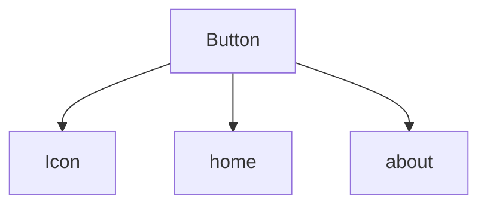

# React Dependency Analyzer

[](https://badge.fury.io/js/react-dep-analyzer)
[](https://github.com/LiTaiChung/react-dep-analyzer/blob/main/LICENSE)

## 安裝

使用 npm：
```bash
npm install react-dep-analyzer
```

使用 yarn：
```bash
yarn add react-dep-analyzer
```

## 使用方式

### 1. 新增腳本指令

在你的 `package.json` 中加入以下腳本：

```json
{
  "scripts": {
    "analyze": "node scripts/analyze.mjs"
  }
}
```

### 2. 建立分析腳本

建立檔案 `scripts/analyze.mjs`：

```javascript
import { createAnalyzer } from 'react-dep-analyzer';

// 建立分析器實例
const analyzer = createAnalyzer({
  // 自定義配置（可選）
  name: 'Component',
  targetPath: 'src/components',
  pagesPath: 'src/pages',
  componentPaths: [
    { 
      path: 'src/components',
      importPrefix: '@/components'
    },
    { 
      path: 'src/elements',
      importPrefix: '@/elements'
    }
  ],
  outputDir: 'tools/componentUsageAnalyzer'
});

// 執行分析
analyzer.run();

// 生成所有格式的報告
analyzer.generateMarkDown();
analyzer.generateDependencyTree();
analyzer.generateJson();
```

### 3. 執行分析

使用 npm：
```bash
npm run analyze
```

使用 yarn：
```bash
yarn analyze
```

## 輸出結果

分析器會生成三種格式的報告：

### 1. Markdown 文檔
元件文檔會直接生成在對應元件的目錄中，保持與原始程式碼相同的結構：

```
src/
├── components/
│   ├── Button/
│   │   ├── index.tsx          # 原始元件
│   │   └── Button.md         # 元件文檔
│   └── Card/
│       ├── index.tsx
│       └── Card.md
└── elements/
    └── Icon/
        ├── index.tsx
        └── Icon.md
```

索引文件和其他報告會生成在配置的 `outputDir` 中：
```
tools/componentUsageAnalyzer/
├── index.md                    # 元件索引
├── component-tree.md          # 依賴樹圖
└── component-dependencies.json # JSON 格式報告
```

#### 元件文檔範例 (Button.md)
```markdown
# Button
> File Path: `src/components/Button/index.tsx`

## Dependency Tree


## Elements Dependencies
> - **@/elements/Icon**
>   - File: `src/elements/Icon/index.tsx`
>   - Imports: `Icon`

## Used in Pages
> - `src/pages/home.tsx`
> - `src/pages/about.tsx`
```

### 2. 依賴樹圖
生成包含所有元件關係的完整依賴樹圖。

### 3. JSON 報告
提供結構化的依賴關係資料，方便程式處理。

## 注意事項

1. 工具預設只分析以大寫字母開頭的匯出（符合 React 元件命名規範）
2. 支援分析命名匯出、預設匯出和批量匯出
3. 目前支援 `.tsx` 檔案的分析，可透過配置擴展支援其他檔案類型
4. 工具會自動尋找專案根目錄（包含 package.json 的目錄）
5. 所有路徑都相對於專案根目錄進行解析
6. 確保專案目錄結構符合配置中指定的路徑
7. Markdown 文檔中的依賴樹圖使用 Mermaid 語法，需要在支援 Mermaid 的環境中檢視（如 GitHub）

## 授權條款

MIT

