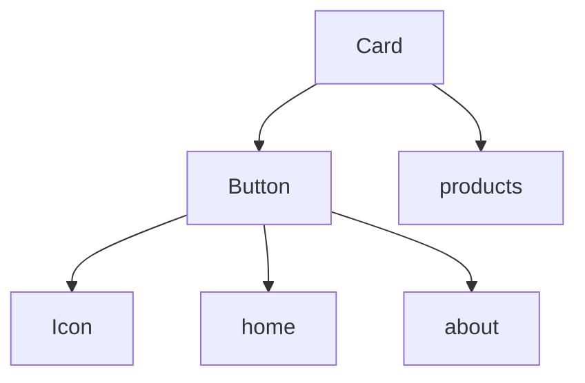

# React Dependency Analyzer

[](https://badge.fury.io/js/react-dep-analyzer)
[](https://github.com/LiTaiChung/react-dep-analyzer/blob/main/LICENSE)

## 安裝

```bash
npm install react-dep-analyzer
```

## 基本使用

```typescript
import { createAnalyzer } from 'react-dep-analyzer';

// 使用預設配置建立分析器
const analyzer = createAnalyzer();

// 執行分析
analyzer.run();

// 生成 Markdown 報告
analyzer.generateMarkDown();

// 生成依賴樹圖
analyzer.generateDependencyTree();
```

## 配置選項

你可以透過傳入配置物件來自定義分析器的行為：

```typescript
interface ComponentPathConfig {
  path: string;          // 元件目錄路徑
  importPrefix: string;  // import 語句的前綴
}

const analyzer = createAnalyzer({
  name: 'Component',              // 分析報告的標題名稱
  targetPath: 'src/components',   // 要分析的元件目錄
  pagesPath: 'src/pages',        // 頁面檔案目錄
  fileExtensions: ['.tsx'],      // 要分析的檔案副檔名
  componentPaths: [              // 元件搜尋路徑配置
    { 
      path: 'src/components',    
      importPrefix: '@/components'
    },
    { 
      path: 'src/elements',
      importPrefix: '@/elements'
    }
  ],
  outputDir: 'tools/usageAnalyzer', // 輸出目錄
  exportNamePattern: /^[A-Z]/,      // 元件名稱匹配模式（預設匹配大寫開頭）
});
```

### 預設配置

工具內建以下預設配置：

```typescript
const defaultConfig = {
  name: 'Component',
  targetPath: 'src/components',
  pagesPath: 'src/pages',
  fileExtensions: ['.tsx'],
  componentPaths: [
    { 
      path: 'src/components',
      importPrefix: '@/components'
    },
    { 
      path: 'src/elements',
      importPrefix: '@/elements'
    }
  ],
  outputDir: 'tools/usageAnalyzer',
  exportNamePattern: /^[A-Z]/,
};
```

## 輸出範例

### Markdown 報告 (dependencies.md)

```markdown
# Component Dependencies and Usage

- Button (src/components/Button.tsx)
  Dependencies:
    - @/elements/Icon (src/elements/Icon.tsx)
      Imports: Icon
  Used in pages:
    - src/pages/home.tsx
    - src/pages/about.tsx

- Card (src/components/Card.tsx)
  Dependencies:
    - @/components/Button (src/components/Button.tsx)
      Imports: Button
  Used in pages:
    - src/pages/products.tsx
```

### 依賴樹圖 (tree.md)

工具會生成一個使用 Mermaid 語法的依賴樹圖，可以直接在支援 Mermaid 的 Markdown 檢視器中顯示（如 GitHub）。



## 注意事項

1. 工具預設只分析以大寫字母開頭的匯出（符合 React 元件命名規範）
2. 支援分析命名匯出、預設匯出和批量匯出
3. 目前支援 `.tsx` 檔案的分析，可透過配置擴展支援其他檔案類型
4. 工具會自動尋找專案根目錄（包含 package.json 的目錄）
5. 所有路徑都相對於專案根目錄進行解析
6. 確保專案目錄結構符合配置中指定的路徑

## 授權條款

MIT
