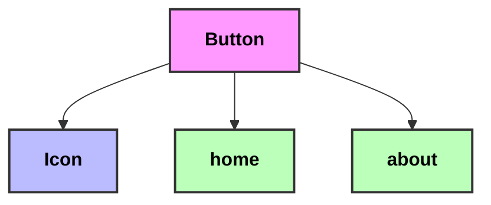

# Button

> File Path: `src/components/Button/index.tsx`

## Dependency Tree

## Elements Dependencies
> - **@/elements/Icon**
>   - File: `src/elements/Icon.tsx`
>   - Imports: `Icon`

## Used in Pages
> - `src/pages/home.tsx`
> - `src/pages/about.tsx`

