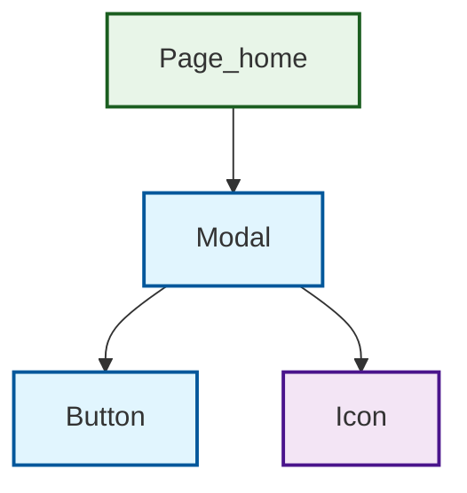
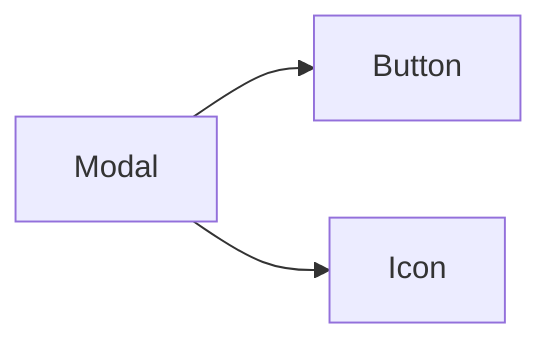

# Modal

> File Path: `src/components/Modal/index.tsx`

## Dependency Tree

## 簡化版本 (如果上面的圖表無法顯示)

## Components Dependencies
> - **@/components/Button**
>   - File: `src/components/Button.tsx`
>   - Imports: `Button`

## Elements Dependencies
> - **@/elements/Icon**
>   - File: `src/elements/Icon.tsx`
>   - Imports: `Icon`

## Used in Pages
> - `src/pages/home.tsx`

