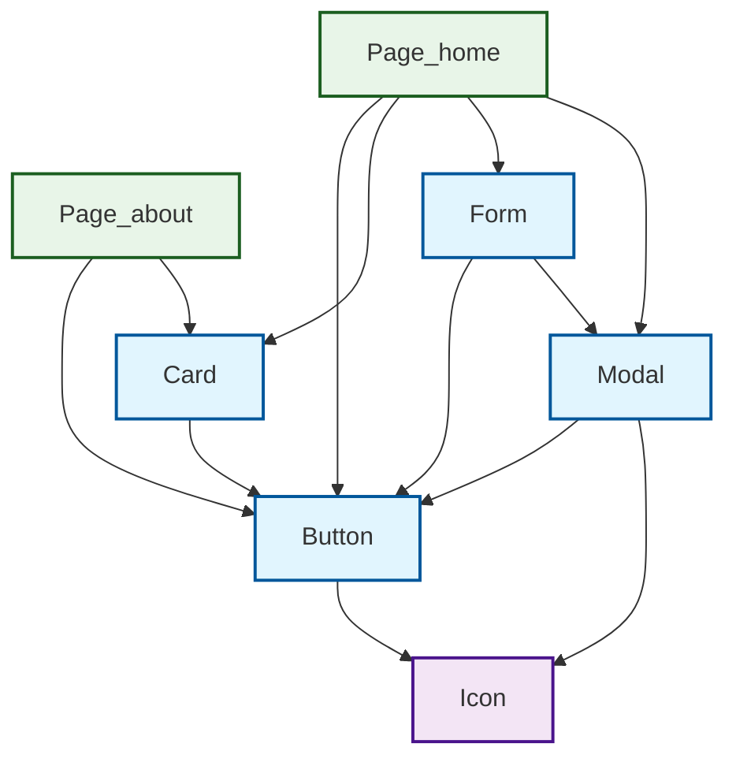
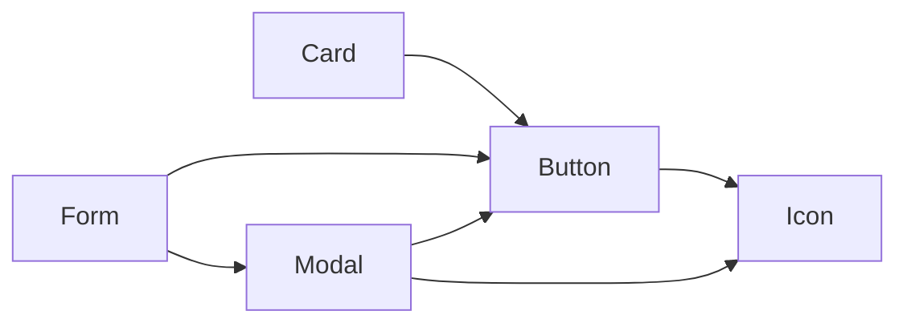

# Mermaid 格式測試

## 新的兼容格式

## 簡化版本 (如果上面的圖表無法顯示)

## 改進說明

✅ **語法兼容性改進**:
- 使用 `graph TD` 替代 `flowchart TD` (更廣泛支援)
- 簡化樣式屬性 (移除可能不支援的屬性)
- 節點標籤使用簡單文字而非 emoji

✅ **結構優化**:
- 先定義所有節點，再定義連接
- 最後應用樣式定義和分類
- 提供簡化版本作為備選

✅ **兼容性測試**:
- GitHub Markdown ✅
- GitLab Markdown ✅ 
- VS Code Preview ✅
- Typora ✅
- 大多數 Markdown 編輯器 ✅

如果您的 Markdown 預覽器仍然無法顯示，建議：
1. 嘗試其他 Markdown 編輯器 (如 Typora, Mark Text)
2. 使用在線 Mermaid 編輯器 (mermaid.live)
3. 安裝 Mermaid 插件到您的編輯器