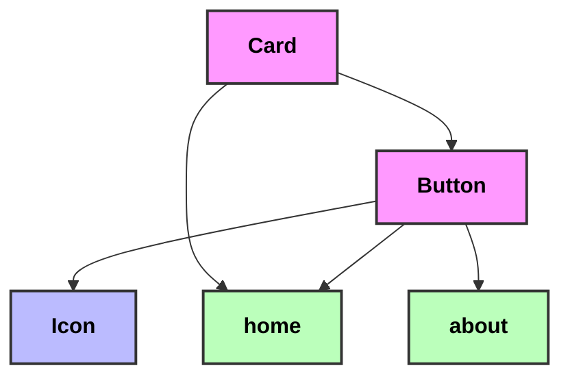

# Component Dependency Tree

```mermaid
flowchart TD
    %% 樣式定義
    classDef component fill:#f9f,stroke:#333,stroke-width:2px,color:#000,font-weight:bold
    classDef element fill:#bbf,stroke:#333,stroke-width:2px,color:#000,font-weight:bold
    classDef page fill:#bfb,stroke:#333,stroke-width:2px,color:#000,font-weight:bold
    classDef other fill:#fff,stroke:#333,stroke-width:1px,color:#000

    Card["Card"]
    class Card component
    Button["Button"]
    class Button component
    Card --> Button
    page_home["home"]
    Card --> page_home
    class page_home page
    Icon["Icon"]
    class Icon element
    Button --> Icon
    Button --> page_home
    class page_home page
    page_about["about"]
    Button --> page_about
    class page_about page
```
